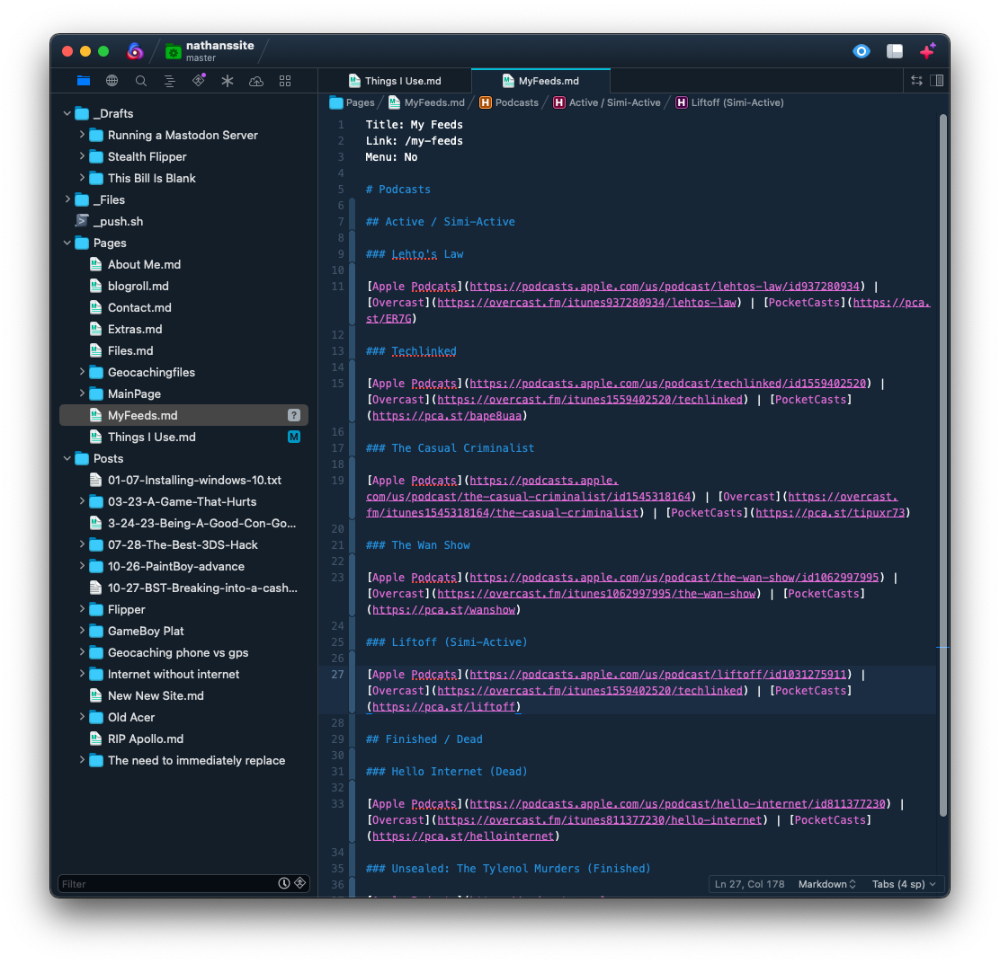

title: testing
link: /testing123
Menu: No

# testing page

You found my testing page, where I test things, welcome[^1]

This is a test, hello[^2]

Test pic [^pic]

```python
list = ["thing1", "thing2", "thing c"]
for x in range(len(list) - 1)
	print(list[x])
```

```bash
#!/bin/bash

# Loop through each subdirectory and run "git pull"
for dir in */; do
  cd "$dir"
  echo "Updating repository in $dir"
  git pull
  cd ..
done
```
This is a test <br>

<details> <summary>Test</summary>

This is a test, I hope it worked

</details>

[^1]: pls leave

[^2]: Sure it is

[^pic]: 

|                | South West   | Spirit       |
|----------------|--------------|--------------|
| Checked Bags   | 2 Free       | Extra Charge |
| Cary on        | Free         | Extra Charge |
| Inflight WiFi  | Extra Charge | Extra Charge |
| Free Messaging | Yes          | No           |
| Soda           | Free         | Extra Charge |
| Alcohol        | Extra Charge | Extra Charge |
| Movies         | Yes          | No           |
| Tray Table     | Yes          | Lol, No      |


> Test

<button onclick="copy1()">Copy text</button>

<script>
   function Copy1() {
   
     // Select the text field
     copyText.select(); 
     copyText.setSelectionRange(0, 99999); // For mobile devices
   
      // Copy the text inside the text field
     navigator.clipboard.writeText("test");
   
     // Alert the copied text
     alert("Copied the text: test");
   }
</script>