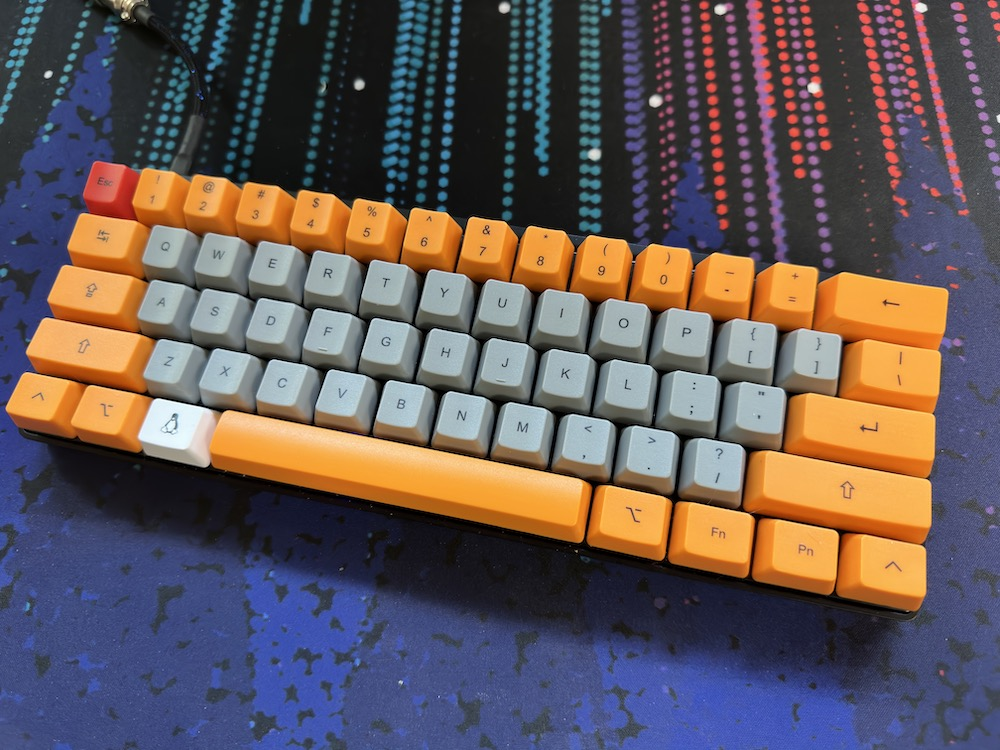

Title: Things I Use
Link: /things-i-use
Menu: Yes

# Things I Use

Jump to: [Hardware](#hardware) | [Home Servers](#servers) | [Software](#software) | [Web Tools](#webtools)

For a list of podcasts and blogs I like, go [here](/my-feeds).

## Hardware [🔗](/things-i-use#hardware)

Phone: [iPhone 14 Pro](https://support.apple.com/kb/SP875?viewlocale=en_US&locale=en_US) in Space Black w/ 256GB Storage

Tablet: [6th gen iPad mini](https://support.apple.com/kb/SP850?locale=en_US)

Watch: [Apple Watch Ultra](https://support.apple.com/kb/SP879?locale=en_US)

Laptop: [Late 2020 M1 MacBook Pro](https://support.apple.com/kb/SP824?locale=en_US) w/ 16GB Ram and 512GB Storage

Monitor: [LG UltraWide 35WN75C](https://www.lg.com/us/monitors/lg-35wn75c-b-ultrawide-monitor)

Keyboard: [WASD VP3 w/ MX Blues](https://www.wasdkeyboards.com/wasd-vp3-61-key-doubleshot-pbt-black-slate-mechanical-keyboard.html)[^1]

Mouse: [Logitech G502 Light Speed](https://www.logitechg.com/en-us/products/gaming-mice/g502-lightspeed-wireless-gaming-mouse.910-005565.html) w/ [Powerplay charging pad](https://www.logitechg.com/en-us/products/gaming-mouse-pads/powerplay-wireless-charging.943-000109.html)

Gaming: 512GB [Steam Deck](https://www.steamdeck.com/en/) Modded to 2TB + [PS5](https://www.playstation.com/en-us/ps5/)

VR: [PSVR2](https://www.playstation.com/en-us/ps-vr2/?smcid=pdc%3Aen-us%3Aaccessories%3Aprimary%20nav%3Amsg-hardware%3Aps-vr2) on [PS5](https://www.playstation.com/en-us/ps5/)

Car: 2015 [Honda](https://youtu.be/w9KYDQry2nQ) Accord Coupe EX-L w/ 2.4L I-VTEC w/ CVT[^2]

Aircraft: DJI Mavic air 2 / DJI FPV

### Home Servers [🔗](/things-i-use#servers)

NAS: [Synology DS418](https://global.download.synology.com/download/Document/Hardware/DataSheet/DiskStation/18-year/DS418/enu/Synology_DS418_Data_Sheet_enu.pdf) w/ 8.7 TB storage using [SHR](https://kb.synology.com/en-us/DSM/tutorial/What_is_Synology_Hybrid_RAID_SHR)

DNS: Raspberry Pi 4 w/ 4GB of ram

Home Auto Protocol Translation Server: Raspberry Pi 3

UniFi Console: [Cloudkey Gen 2 Plus](https://store.ui.com/us/en/products/unifi-cloudkey-plus)

## Software [🔗](/things-i-use#software)

OS: [macOS 13](https://en.wikipedia.org/wiki/MacOS_Ventura)

Email: [iCloud Mail](https://icloud.com) + [SimpleLogin](https://simplelogin.io)

Cloud Storage: [iCloud](https://icloud.com) + [Synology DSM](https://www.synology.com/en-us/dsm)

Mastodon Server: [Masto.host](https://masto.host)

Mastodon Client: [Ivory for iOS](https://tapbots.com/ivory/), and [Mac](https://tapbots.com/ivory/mac/), sometimes [Toot CLI](https://github.com/ihabunek/toot)

This Website: [Blot.im](https://blot.im) w/ Git

DNS: [Pi-Hole](https://pi-hole.net)

Clipboard History: [Pastebot](https://tapbots.com/pastebot/)

RSS: [Miniflux](https://miniflux.app) / [Reeder 5](https://www.reederapp.com)

Podcast Client: [Overcast](https://overcast.fm)

Video Downloader: [Downie](https://software.charliemonroe.net/downie)

Video Editor: [Final Cut Pro](https://www.apple.com/final-cut-pro/)

Vid To GIF Convertor: [Apple Compressor](https://support.apple.com/compressor)

Photo Editor [Affinity Photo 2](https://affinity.serif.com/en-us/photo/)

FTP Client: [Tansmit 5](https://panic.com/transmit/)

Text Editor: [Nova](https://nova.app)

Flight Tracker: [Flighty](https://flightyapp.com)

Task Manager: [Todoist](https://todoist.com)

## Web Tools [🔗](/things-i-use#webtools)

Email to RSS: [Kill The Newsletter](https://kill-the-newsletter.com)

 

Note: **None** of these link are affiliate links

[^1]: 
[^2]: With bonus dog, Ruby   