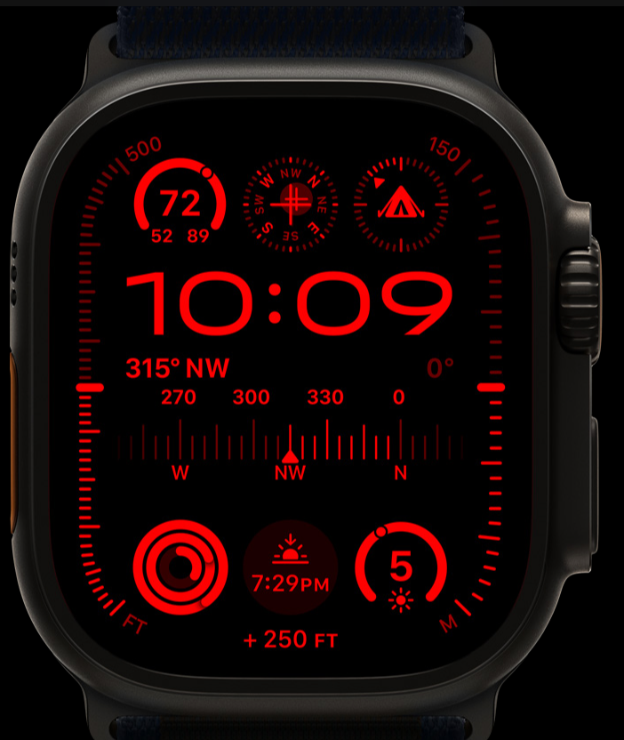

Title: Apple September Event
Date: 2023-09-12 19:39 EDT
Draft: No
Tags: Short Post

# Apple September Event

Jump to: [Watch](#watch) | [S9](#s9) | [Ultra 2](#ultra2) || [iPhone](#iphone) | [15](#15) | [15 Pro](#15pro)

Another year, another event from Apple. And as a tech nerd with a blog, might as well make a post about what I think.

Note: This will not be an exhaustive list of every new feature, visit [Apple.com](https://apple.com) for that.

## Stuff announced, and my thoughts

### Apple Watch [🔗](#watch)

#### S9 [🔗](#s9)

Overall, a basic update, just like every apple watch before it.  
The new series 9 bring on device Siri processing, a brighter screen, and a new gesture. You can now double tap your index finger, and thumb to preform an action, Like pick up, or hang up a call, stop a timer, etc.  
The watch also gets a new ultra wide band chip. Allowing for precision finding of your iPhone 15

#### Ultra 2 [🔗](#ultra2)

The Ultra 2 gets the same upgrades as the S9. Though it has a even brighter screen, up to 3000 nits vs 2000 on the S9.  
The Ultra 1/2 also gets a new watch face[^1].

#### Thoughts [🔗](#watch-thoughts)

Over all, these are pretty small and basic upgrades to the Apple Watch. That's not a bad thing. The Apple Watch has always has small upgrades.  
The watch band connector also hasn't changed, unlike what the rumors were saying.

### iPhone [🔗](#iphone)

#### iPhone 15 [🔗](#15)

The iPhone 15 is now getting the features of last years 14 Pro.  
Non pro users will now get the 48MP camera, and the Dynamic Island. Both fantastic upgrades for non pro users.

SOS via satellite is now getting roadside assistance through AAA[^2].

Update: Roadside via satellite will also be available on iPhone 14, and 14 Pro

The 15 also gets a new ultra wide band chip. With three times the range of the old one. That allows for precision finding of friends. That will be great for con goers

The 15 as also killed off the Lightning port, and has replaced it with USB-C.

#### iPhone 15 pro [🔗](#15pro)

The 15 Pro gets some fancy new features.  
It's camera can now mimic different lens. It's now made out of Titanium. The mute switch has been killed, and replaced with a programable Action Button.

The 15 Pro also gets same roadside via satellite feature, UWB chip, and the UBS-C port.

#### Thoughts [🔗](#iphone-thoughts)

Overall, the 15 and 15 pro feel like a 14S, and 14S Pro. Nothing overly grabbing for me as a 14Pro user. But small upgrades add up over time, and those that upgrade, will have a great experience.

[^1]: 
[^2]: The roadside company, not the [battery](https://www.youtube.com/watch?v=_asuhfYa5_4).