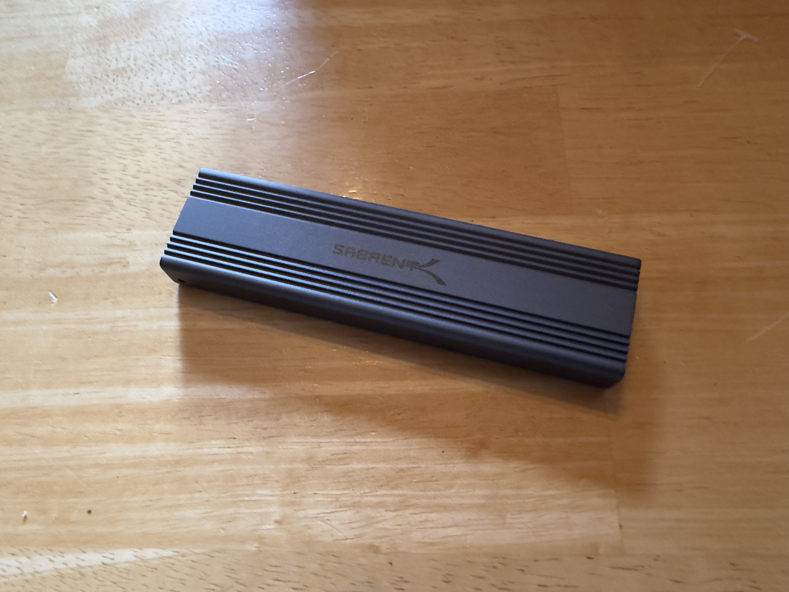
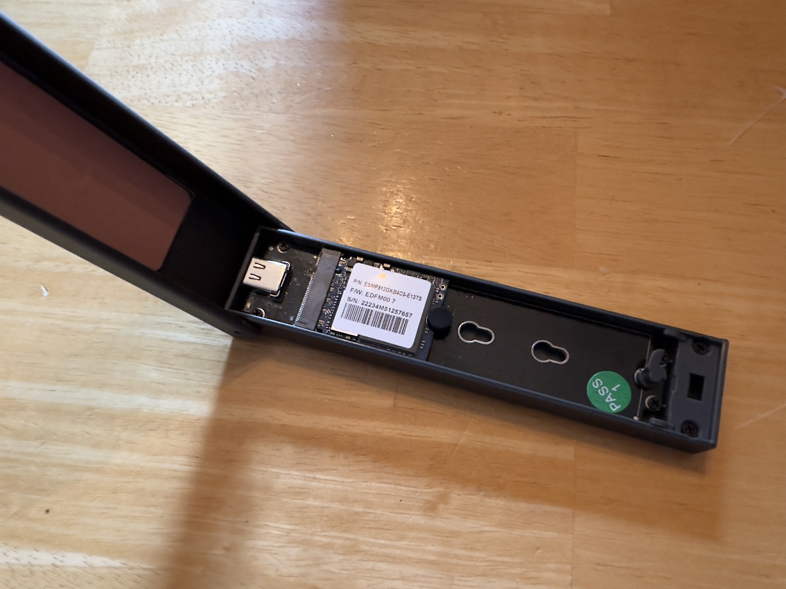

Title: Making a Fast As Hell Flash Drive
Date: 2023-10-27 20:37 EDT
Tags: Short Post

# Making a Fast As Hell Flash Drive

A while back, I upgraded the storage in my Steam Deck. Going from 512GB, to 2TB. The upgrade was so worth it. But, as a result, I had a 512GB SSD just sitting around. 

After a while, I ended up ordering an NVME SSD enclosure. 

After chucking the SSD in there, and formatting it. I now have a little, fast as hell, USB drive. That I can also use if I need to image other NVME drives.

[Reply to this post via email](mailto:reply.13a8f@nthp.me?subject=Re: Making a Fast As Hell Flash Drive)