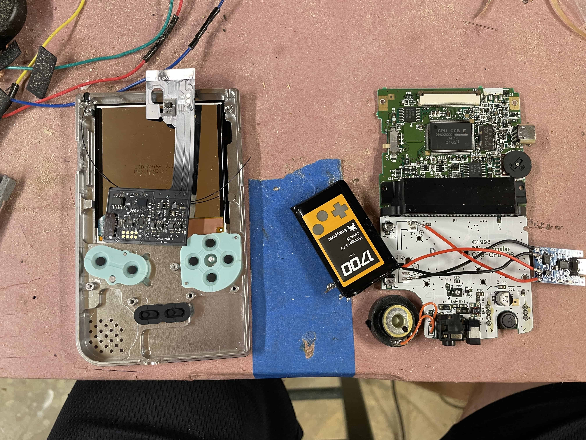
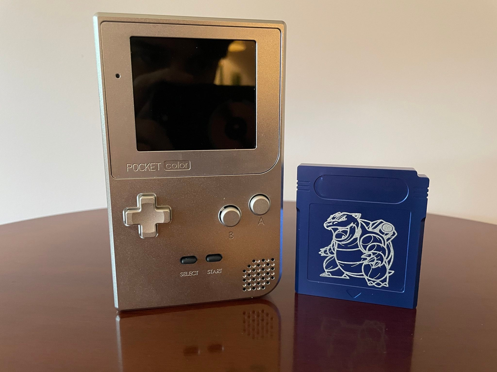
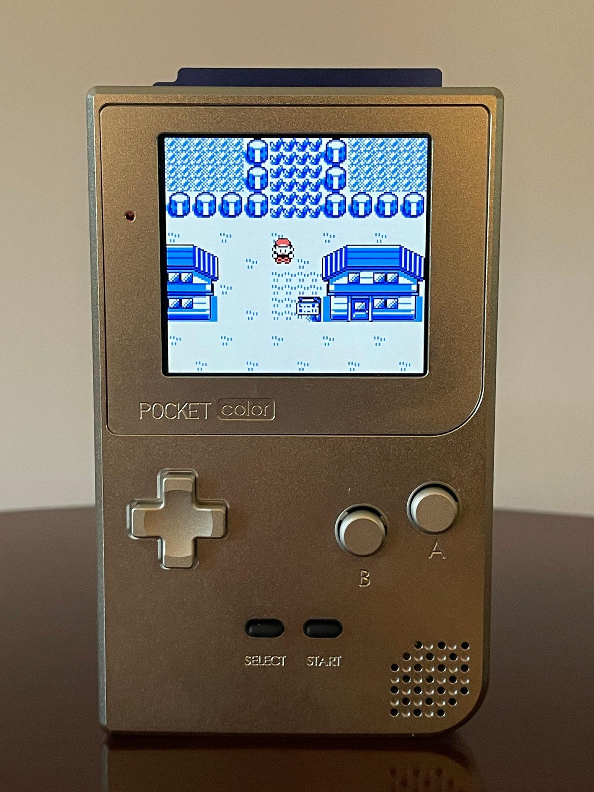
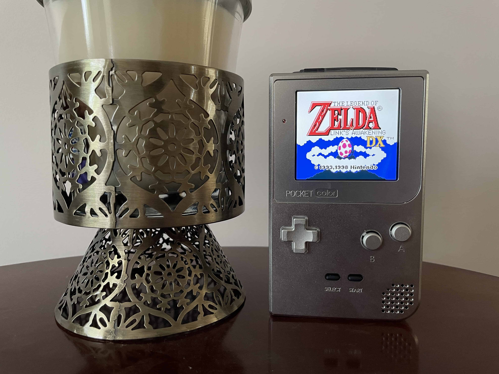
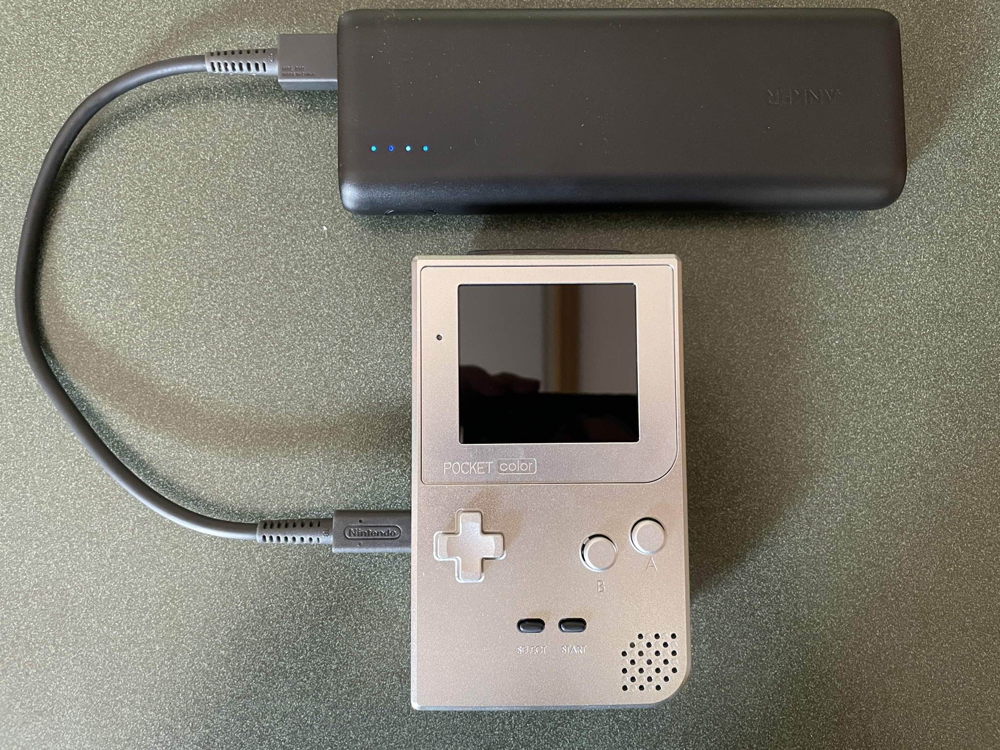

Title: GameBoy Platinum
Date: 2023-4-12
Tags: Modding

# GameBoy Platinum

A while back a built a GameBoy that I never shared here. Every year-ish, the [GameBoy sub-reddit](https://old.reddit.com/r/gameboy) hosts a modding / build competition. You build a custom GameBoy, submit it, and other redditers vote for the winner. The winner gets some credit to some big parts stores. Cool, I’ll toss my hat in.

The Idea I had was simple, An aluminum GameBoy Color, but in the shape of a GameBoy Pocket, with in an IPS screen. This idea was nothing over the top, and only used off the shelf parts. I didn’t really expect to win, a metal GameBoy is nothing new. A metal game cartridge though, that I haven’t seen much. 

I got the parts in for the system first. I quickly realized that the wiring for the battery was going to be a pain. There’s not much room inside this thing.

Getting the shell to close was a massive pain. But, I did get it to close. The build wasn’t finished at this point, but man did it look good. After some waiting the last part I needed was back in stock. The metal cartridge. Now, I wasn’t just going to get a metal cart shell. I was going to have the label laser etched onto it. After some more waiting. I had, what I called, The GameBoy Platinum.

This is one of my best looking builds. Blue and silver aluminum, IPS screen, and USB-C charging (yep). In the end, I didn’t win, but that’s not why I entered. Going to be honest here, I only entered as an excuse to build this thing. Aluminum parts aren’t cheep.

