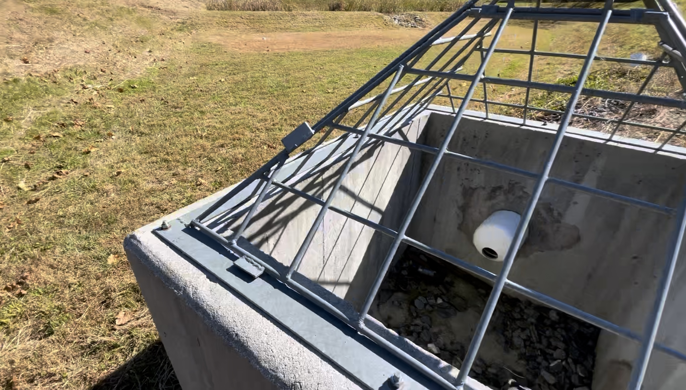

Title: Geocaching: Phone Vs GPS
Date: 2023-4-12
Tags: Geocaching

# Geocaching: Phone Vs GPS

If you follow me online you may know that I like to go geocaching. What is geocaching you might ask? Geocaching is climbing down a storm drain to sign a log book. Ok, not really, but also kinda. Geocaching is the hobby of going (physically) to a set of GPS coordinates, and signing a hidden logbook. And yes, the logbook could be hidden in a storm drain.

I've been Geocaching for a few years now. To find the caches, I use a Garmin GPSMAP 64SX. A hiking GPS. Every now and then, other cachers ask me, "Why?". The answer (for me at least) is battery life, and accuracy.

Let’s start with that first one, battery. You’ve used the navigation app on your phone. It burns through the battery. The Garmin sips power. It’ll last much longer than your phone, and it won’t kill your phone’s battery.

The Garmin is also more accurate. My phone (an iPhone 14 Pro) is usually around +/ 12-16 feet. The Garmin is around +/- 6-8 feet. This helps some with finding a cache. What it really helps with, is taking good coordinates when hiding a cache. Trust me, when the coordinates are spot on for your hide, it makes cachers happy.

Here’s a quick pros and cons list on both the Garmin, and a phone.

# Garmin 

## Pros

- Longer battery life
- Doesn’t need a backlight in direct sunlight
- More accurate 
- Full offline maps and cache info
- No internet needed in the field

## Cons

- Can be Pricy
- Depending on the model you will have to load that cache files on manually

# Phone

## Pros

- You already have it
- Can live search for caches
- Can post cache logs

## Cons

- Not great battery life when using the GPS radio
- Needs a bright backlight in direct sunlight burning battery
- Needs internet (Unless you downloaded offline data)
- Less accurate 

In the end, your phone is more than enough, especially if you are just starting out. Personally, I use the Garmin to find the cache, then my phone to send the log. What you use is really up to you. The important is, have fun. And don’t let the muggles know what you are doing.
