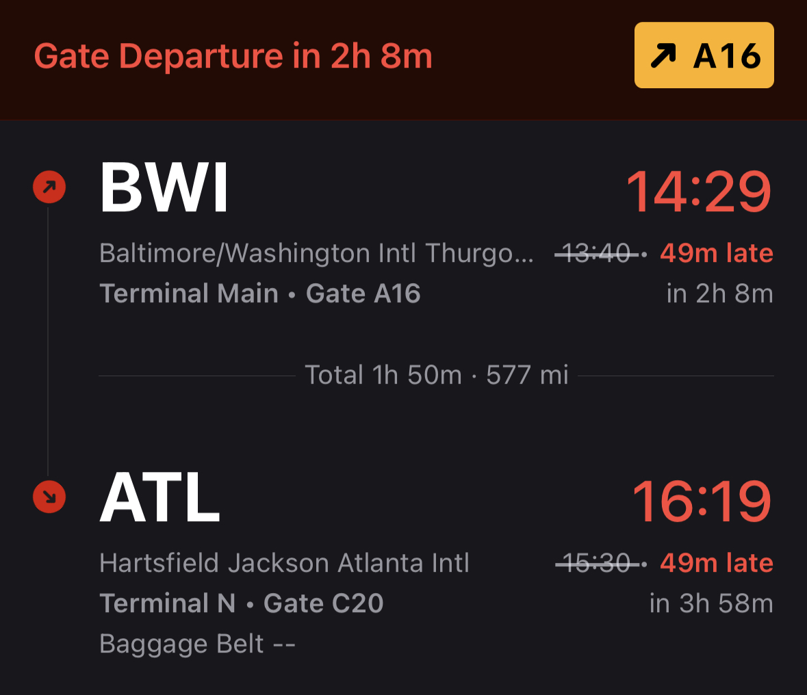
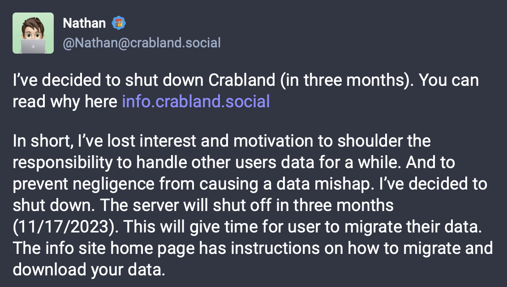

Title: New Mastodon Handle
Date: 2023-08-21 12:30 EDT
Draft: No
Tags: Short Post, Air Craziness

# New Mastodon Handle

With the shutting down of Crabland.social[^1], I've migrated my account to a new server.  
I'm using the same hosting provider [Masto.host](https://masto.host), just can't beat their pricing. My new server is a singer user one (not running in single user mode, because I think it looks ugly), [mstdn.nthp.me](https://mstdn.nthp.me). I'm going to try and cut down the amount of domains I own (too many), so I'm going to be tying more things to my main one (this one). 

That's pretty much all I got, if you were following my old Mastodon account, you should be automatically following my new one [@nathan@mstdn.nthp.me](https://mstdn.nthp.me/@nathan). I'm also posting this form an airport, so that's neat... my flight got delayed though...

[^1]: 