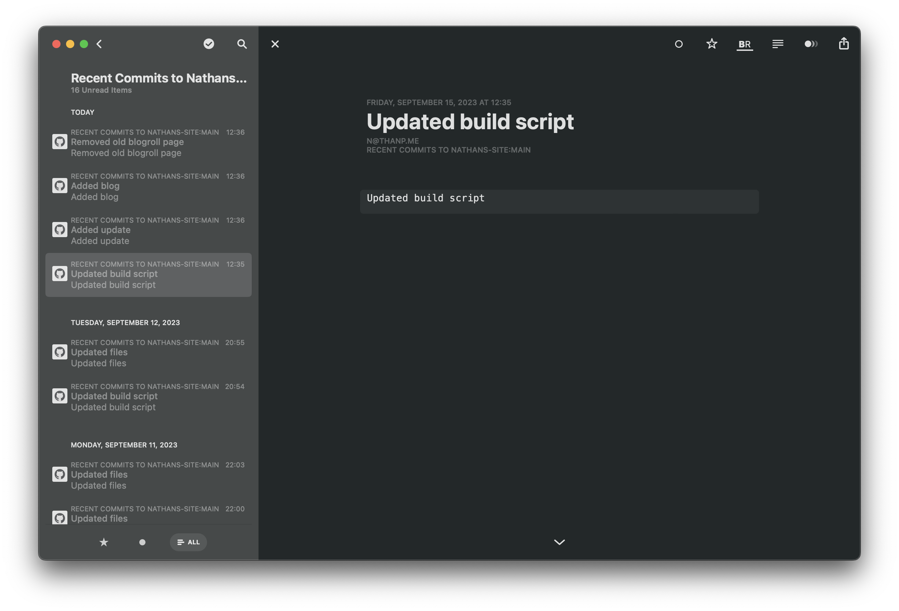
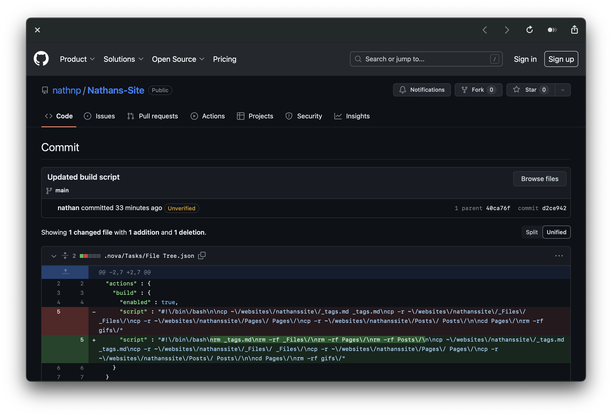

Title: New Site Update Feed
Date: 2023-09-15 13:25 EDT
Draft: No

# New Site Update Feed

## Update

For those that don't know, this site is hosted using blot.im. blot, basically turns a folder of markdown files into a website. I've had these markdown files up on my github for a while now. But I'm making some needed (and wanted (by me)) changes.

1. You can now subscribe to changes made to this site. That includes new public pages, and any updates to them.

2. I'm making the github repo more understandable.

## Details

Let's start with number one. Linked here (and on my homepage) will be a new [feed url](https://github.com/nathnp/Nathans-Site/commits/main.atom). This will update with every commit made to the main branch. There are some downsides. The body only contain the commit message[^1]. However, if you click though, you'll get the commit page showing you what changed[^2].

On to Number two. What I was doing in the past for the public repo, wasn't great. I was just bundling a bunch of changes into one large commit. With the massage of "updated files". That's changing, as you can see by going to the [repo](https://github.com/nathnp/Nathans-Site).

## Link

If you'd like to subscribe to this feed, just add this link to your reader [https://github.com/nathnp/Nathans-Site/commits/main.atom](https://github.com/nathnp/Nathans-Site/commits/main.atom)

[^1]: 
[^2]: 
 