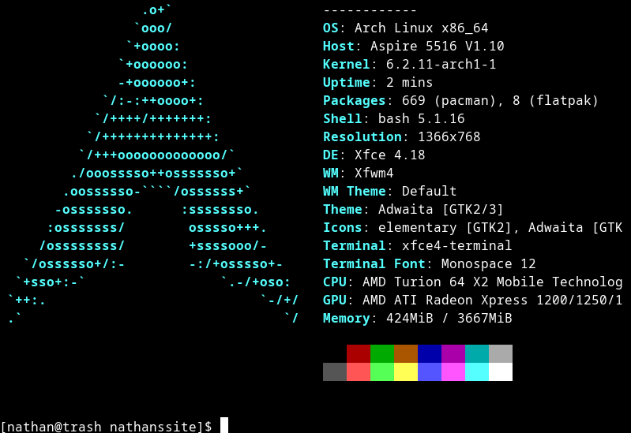

Title: Old Acer
Date: 2023-4-13
Tags: Short Post

# Old Acer

This is going to be a short post (Thus the tag).
I dug up my old Acer laptop. An Acer Aspire 5516, built in 2009. Yep a 14 year old laptop (My first laptop in fact. I was playing around with it, seeing if I could get an up to date OS on it. In short yes. The laptop has a 64-bit CPU, and I knew I really only had one option. Arch. With Arch, I could basically build an install that would play nice with hardware. Spoiler, It works.

The main point of this post, is that it was posted from this old thing. Blot.im (The hosting provider I use), lets me post using git. So all I need to make a post, is a text editor, a git client, and at least a piss poor internet connection.

