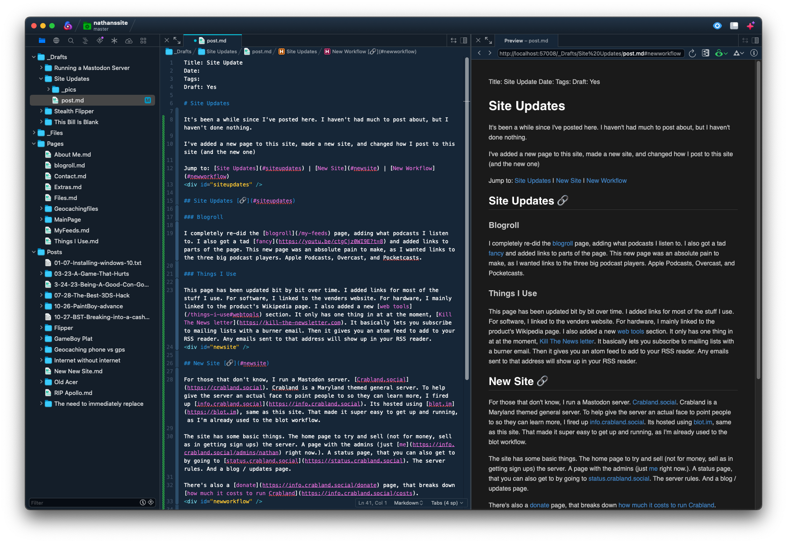

Title: Site Updates
Date: 2023-08-1
Tags:
Draft: No

# Site Updates

It's been a while since I've posted here. I haven't had much to post about, but I haven't done nothing.

I've added a new page to this site, made a new site, and changed how I post to this site (and the new one)

Jump to: [Site Updates](#siteupdates) | [New Site](#newsite) | [New Workflow](#newworkflow)

## Site Updates [🔗](#siteupdates)

### Blogroll

I completely re-did the [blogroll](/my-feeds) page, adding what podcasts I listen to. I also got a tad [fancy](https://youtu.be/ctgCjz0WI9E?t=8) and added links to parts of the page. This new page was an absolute pain to make, as I wanted links to the three big podcast players. Apple Podcasts, Overcast, and Pocketcasts.

### Things I Use

This page has been updated bit by bit over time. I added links for most of the stuff I use. For software, I linked to the venders website. For hardware, I mainly linked to the product's Wikipedia page. I also added a new [web tools](/things-i-use#webtools) section. It only has one thing in at at the moment, [Kill The News letter](https://kill-the-newsletter.com). It basically lets you subscribe to mailing lists with a burner email. Then it gives you an atom feed to add to your RSS reader. Any emails sent to that address will show up in your RSS reader.

## New Site [🔗](#newsite)

Crabland has shutdown (and so has it's site), but you can still read this section if you want to.

For those that don't know, I run a Mastodon server. [Crabland.social](https://crabland.social). Crabland is a Maryland themed general server. To help give the server an actual face to point people to so they can learn more, I fired up [info.crabland.social](https://info.crabland.social). Its hosted using [blot.im](https://blot.im), same as this site. That made it super easy to get up and running, as I'm already used to the blot workflow.

The site has some basic things. The home page to try and sell (not for money, sell as in getting sign ups) the server. A page with the admins (just [me](https://info.crabland.social/admins/nathan) right now.). A status page, that you can also get to by going to [status.crabland.social](https://status.crabland.social). The server rules. And a blog / updates page.

There's also a [donate](https://info.crabland.social/donate) page, that breaks down [how much it costs to run Crabland](https://info.crabland.social/costs).

## New Workflow [🔗](#newworkflow)

I'll be honest, my old workflow for posting here was... [garbage](https://www.youtube.com/watch?v=U408cVHw0fY). This site is hosted using blot. Blot turns a folder, into a website. Pages (and posts), are .md files. You use a combination of Markdown, and HTML (if you want). That's not the garbage part, blot is fantastic. The garbage part is that I was doing all this in the terminal.  All the files were written using VIM, and synced with Git CLI. The git part was fine, but VIM was not. 

Now, as a member of the cult of VIM, I have no problem using VIM. My problem was, VIM doesn't care if you make a typo, and if you know me in real life, I dont spel gud. So that made it a bit of a pain. The solution, use a modern text editor. I tried a few, but ended up settling with [Panic's Nova](https://nova.app). Holy crap Nova is nice. It's built for writing script and programs (which I do every now and then), but it works amazingly with Markdown and HTML. I won't go into detail on what it can do (as I've only been using it for about a week), So I'll just drop a screen shot of this post in it.

Posting is also super easy, as Nova has git support.

